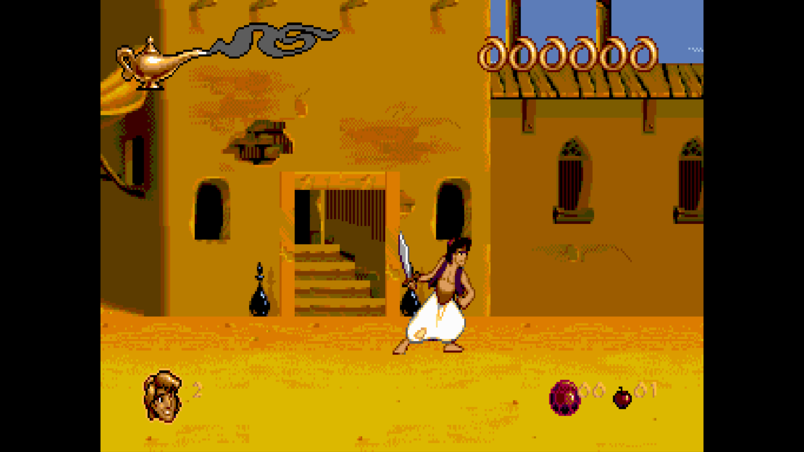

# Aladdin 1997 Windows Fix

An unofficial compatibility fix for the Windows version of *Disney's Aladdin*
included in the 1997 *Disney Classic Video Games* compilation.

It restores correct graphics, sound, timing and modern Windows integration
while keeping the original game data. The project was developed from a
personally owned physical copy and validated on Windows 10 22H2.

> This repository and its downloads contain **no game executable, music,
> artwork or other Disney assets**. You need your own original disc or
> installation.

*Running on Windows 10 in borderless 4:3 at 60 FPS. Screenshot captured from
the project owner's original physical copy; the pictured game content is not
covered by this project's MIT licence.*

## Download and install

1. Open the [latest release](https://github.com/Miduin2/aladdin-1997-windows-fix/releases/latest).
2. Download the named `GameVaultDraw_*.zip` asset. Do not download GitHub's
   automatically generated “Source code” archives unless you want to compile
   the project yourself.
3. Extract the ZIP.
4. Copy the contents of its `patch` directory beside your original
   `ALADDINW.EXE` and MIDI files.
5. Run `Install patch.cmd` once.
6. Start the game with `Play Aladdin.exe`.

The installer verifies the exact original executable before changing anything,
creates a checked backup and refuses unsupported versions. Run
`Restore original.cmd` to restore the verified original executable.

## What it fixes

- obsolete 256-colour detection;
- privileged x86 `CLI` and `STI` instructions rejected by modern Windows;
- invalid DirectDraw destination rectangles and 8-bit palette handling;
- black output, unstable exclusive fullscreen and uncontrolled game speed;
- long-path MCI/MIDI crashes;
- taskbar, Alt+Tab, thumbnail and live-preview integration;
- crashes in the original Joystick and Keyboard settings pages;
- access to the original Properties panel with `F2`;
- a safe pause-and-exit dialog with `Esc`.

The default presentation is borderless 4:3 at 60 FPS and does not change the
desktop resolution.

## Supported executable

- Original SHA-256: `77B7B7B03F80BAD087E23217D4CDCA51A5F93C550D0FF290B22EC7FB4694C209`
- Patched SHA-256: `8CE7F608D1BFEF1F67B5495D33653ED602B1CA05BBFC521255D9D6DF48FB4740`

Only that exact executable is supported. No unknown executable is modified.

## Source and technical documentation

- `src/gamevaultdraw`: the 32-bit DirectDraw compatibility layer;
- `src/gamevaultlauncher`: the native console-free short-path launcher;
- `installer`: auditable installation and restoration scripts;
- `recipes`: the strict Game Vault patch recipe;
- `docs/TECHNICAL_REPORT.es.md`: complete Spanish technical report;
- `docs/REPRODUCIBILITY.md`: build and reproduction instructions;
- `docs/VALIDATION.md`: validation record;
- `diagnostics`: sanitized evidence for the repaired failures.

The compiled `ddraw.dll` and `Play Aladdin.exe` are distributed in the
release asset, not committed to the source tree.

## Validation status

Version 1.1.1 was validated with the opening logos, main menu, gameplay, MIDI
music, voices, sound effects, difficulty changes, keyboard remapping, Joystick
and Keyboard settings pages, `F2`, `Esc`, taskbar and `Alt+Tab`. The patch
contains no original game files and accepts only the executable whose hash is
listed above.

A detailed technical report is also available
[in Spanish](docs/TECHNICAL_REPORT.es.md).

## Disclaimer

This is an independent, unofficial preservation and compatibility project. It
is not affiliated with, endorsed by or sponsored by Disney or the original
game's developers and publishers. All third-party names, trademarks and game
assets belong to their respective owners.

## License

The original compatibility code, launcher and scripts in this repository are
available under the [MIT License](LICENSE). That licence does not apply to the
original game or any third-party property.
